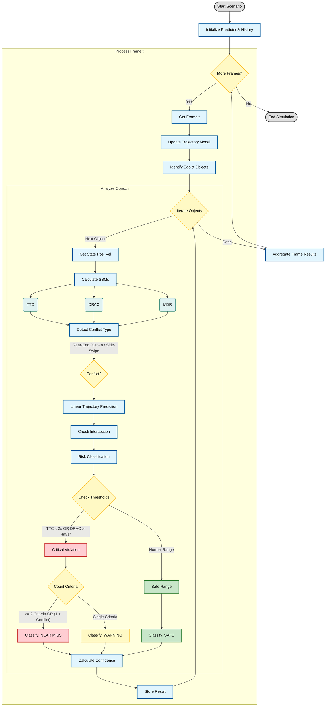

# Near-Miss Prediction Algorithm Flowchart

This flowchart describes the deterministic rule-based near-miss prediction logic implemented in the simulator.

## Description of Logic

1.  **Initialization**: The predictor sets up tracking history and loads configuration/thresholds.
2.  **Frame Loop**: Iterates through each time step of the simulation.
3.  **Object Analysis**: For every object in the frame relative to the ego vehicle:
    *   **SSM Calculation**: Computes Surrogate Safety Measures like Time-To-Collision (TTC), Deceleration Rate to Avoid Collision (DRAC), and Minimum Distance Ratio (MDR).
    *   **Conflict Detection**: Analyzes spatial relationship (Ahead, Behind, Alongside) and velocity vectors to categorize conflict types (Rear-End, Side-Swipe, Cut-In, etc.).
    *   **Trajectory Prediction**: Uses a constant velocity model to project future positions (linear extrapolation).
4.  **Risk Classification**:
    *   Checks calculated SSMs against defined thresholds (Safe, Warning, Critical).
    *   A **Near-Miss** is declared if:
        *   TTC, DRAC, or MDR exceed critical thresholds.
        *   Multiple criteria are met simultaneously (e.g., Low TTC + Conflict Detected).
    *   **Confidence Score**: Calculated based on the consistency of the tracking history and agreement between multiple SSMs.
5.  **Result Aggregation**: Results are compiled for visualization and evaluation metrics.
